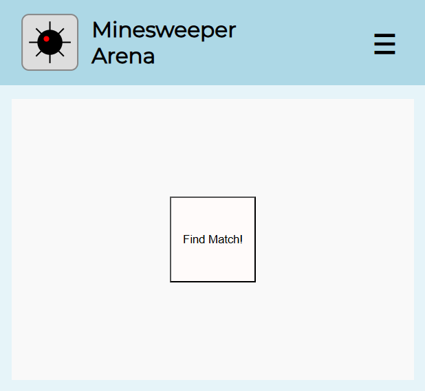
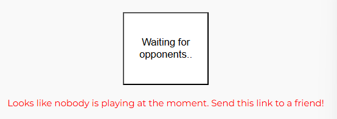
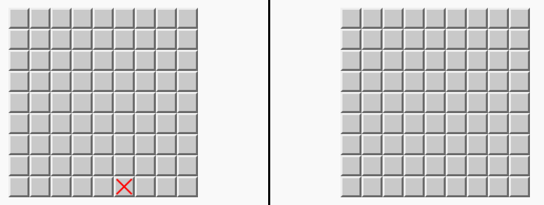
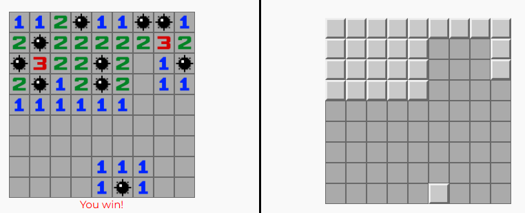
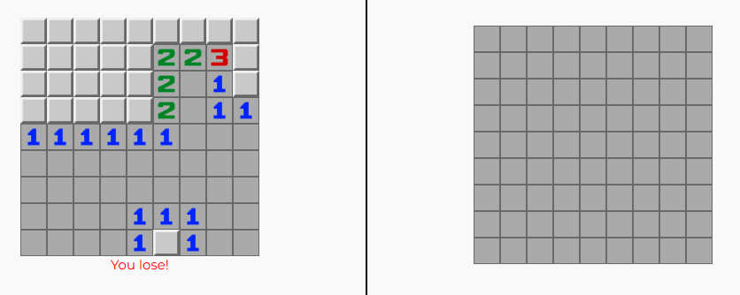

## Minesweeper Arena

A browser-based, real-time multiplayer Minesweeper game built with Go (backend) and vanilla JavaScript (frontend). Players are matched randomly to compete on a shared board and race to finish first.

### Features

- Real-time 1v1 multiplayer gameplay
- Shared minefield logic for consistent state
- WebSocket-based client-server communication
- Matchmaking queue system
- Flag placement and mine detection
- Custom graphics, including logo and minesweeper icons
- Sound effects for game events (start, win, loss)
- Responsive UI

### Run

```sh
git clone https://github.com/yourname/minesweeper-multiplayer.git
cd minesweeper-multiplayer
go run .
```

The server will start at [http://localhost:80](http://localhost:80), unless configured otherwise.

### The Application

The center of the application is a single button that connects the client to the server using a non-blocking WebSocket. The client enters a matchmaking queue and is paired with another client when available. The clients enter a game once paired.

All interactions are routed through the server. The client sends requests to reveal cells, and the server responds with updated state. Game logic resides entirely on the server, which enforces rules and prevents any client-side tampering.

The client sees its own board on the left with full visibility. The opponent's board is shown on the right but only displays interacted tiles, not their values. This allows tracking opponent progress without revealing information about the board layout.

### Client interaction & Gameplay
Clients are presented with a single button in middle of the screen:


By pressing it, socket is created, and they join a queue:


When paired with another client, they are presented with  responsive double-board layout. The cross marks a starting position for the player. The player is not forced to start on cross, but risks revealing a bomb on his first turn.


When client reveals a mine, the board is revealed to him and he waits until the other client finishes.


Solving the full board results in immediate victory:


and loss for the opponent:



#### Game Termination Rules

- A player wins by revealing all safe cells first.
- If one player hits a mine, he waits for the other player to finish.
- If both players hit a mine, the player with more revealed safe cells wins. If tied, the faster player wins.

The game ends immediately when any of the above conditions are met.

### Missing planned features

Currently, the application is missing user-reliant features which is not yet implemented. The planned features were:
- Ladder, present in aside section of the application, and through a menu item
- Recent matches, present in aside section of the application, and through a profile

### Author

Created for Czech Technical University, Faculty of Electrical Engineering  
Course: Vývoj klientských aplikací v JavaScriptu (B0B39KAJ)  
2025 — Marek Jagoš
